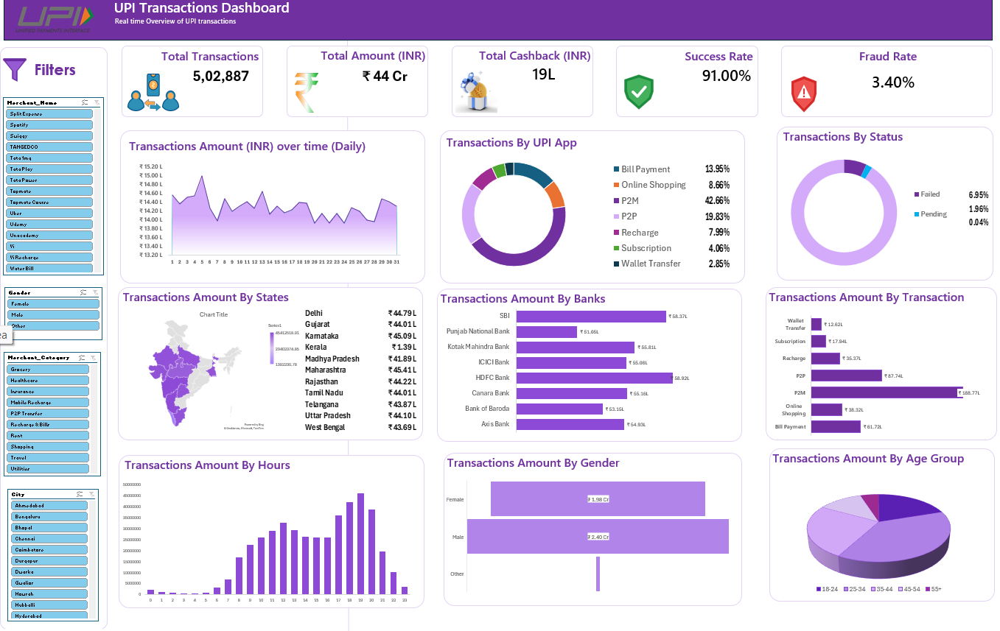

# UPI Transactions Dashboard (Excel)

An interactive Excel dashboard that gives a real-time style overview of UPI transactions: volume, amount, success and fraud rates, and how spending varies by category, bank, state, hour, gender and age group.

## Project Overview

| Item | Details |
|---|---|
| Goal | Turn raw UPI transaction data into an interactive, easy-to-read dashboard |
| Tool | Microsoft Excel |
| Techniques | Pivot Tables, Pivot Charts, Slicers, Map Chart, KPI cards |
| Dataset | PhonePe-style UPI transaction data (about 5 lakh transactions) |

## Key Metrics

| Metric | Value |
|---|---|
| Total Transactions | 5,02,887 |
| Total Amount | about ₹4.4 Cr |
| Total Cashback | ₹19 L |
| Success Rate | 91.00% |
| Fraud Rate | 3.40% |

## Dashboard Sections

- **KPI cards:** transactions, amount, cashback, success rate, fraud rate
- **Daily trend:** transaction amount across the days of the month
- **Transaction type split:** P2M, P2P, bill payment, recharge, shopping, subscription, wallet transfer
- **Status split:** success, failed and pending share
- **Amount by state:** map chart with state-wise totals
- **Amount by bank:** comparison across 8 major banks
- **Amount by hour:** peak and off-peak time of day
- **Amount by gender and age group:** who is spending
- **Slicers:** Merchant Name, Gender, Merchant Category and City filters that update the whole dashboard

## Key Insights

1. **Merchant payments (P2M) lead.** P2M makes up about 43% of transactions, more than double P2P (about 20%).
2. **Evening is peak time.** Payment amount rises from early morning, has a lunchtime bump, and peaks around 7 PM before dropping sharply after 9 PM.
3. **Men spend more.** Male users account for about ₹2.40 Cr versus about ₹1.98 Cr for female users, and the 25-34 age group is the biggest spender.
4. **Banks are closely matched.** HDFC Bank and SBI lead, but the gap between the top banks is small.
5. **About 9% of transactions do not succeed.** Around 7% fail and about 2% stay pending, which is a clear friction point.
6. **Fraud rate is 3.40%,** worth monitoring alongside the failure rate.

## How to Use

1. Download the Excel file (see link below).
2. Open the **Project** sheet.
3. Click the slicers on the left (Merchant, Gender, Category, City) to filter the dashboard.
4. Click the slicer clear icon to reset the filters.

## Files

| File | Description |
|---|---|
| `dashboard.png` | Dashboard screenshot |
| `REPORT.md` | Detailed analysis report |
| Excel file | [Add Google Drive link here] (raw data is too large for GitHub) |

## Author

**Vivek Patidar**
B.Tech CSE, Jabalpur Engineering College

- LinkedIn: [linkedin.com/in/vivek-patidar-393b71404](https://linkedin.com/in/vivek-patidar-393b71404)
- GitHub: [github.com/vivekpatidar252](https://github.com/vivekpatidar252)
